## WorldWise 🎇

WorldWise is a website which you can keep register for your travel by marking the world map. You can just visit home, pricing and product pages without login. The login page will be open clicking Login button or start tracking now button. You can login with the registered email and password. If you want to add any city your list after you click the map the form will be opened. The form already will be filled with the city name and that day's date. The location will be taken by functions in Leaflet library which triggered by the user's click. If you want, you also can add your note. After you submitted the form, the city will be rendered in cities list 🎞.

If you click the city in cities list , you are able to see the city's detail page. You can turn back the cities list by clicking the back or the cities button. You can add as many as city you want. You can visit these cities on Wikipedia. You can also be displayed the countries you have visited by clicking the counties button.

You can find your location after clicking use your position button and allow it to use your location. Also you can delete the city by clicking the city's delete button. If you click the logout button, you will be redirected to homepage 🌊.

You can try by clicking <strong>[ WorldWise ](https://world-wise-gldn.netlify.app/)</strong>.

## Technologies Used

- HTML
- CSS
- React.js(useState, useEffect, useContext, useReducer)

 

   
   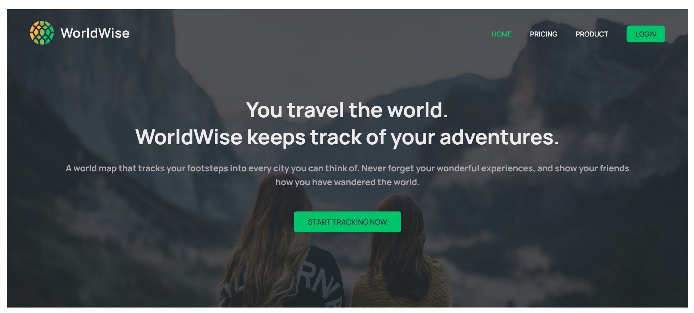
 
   
   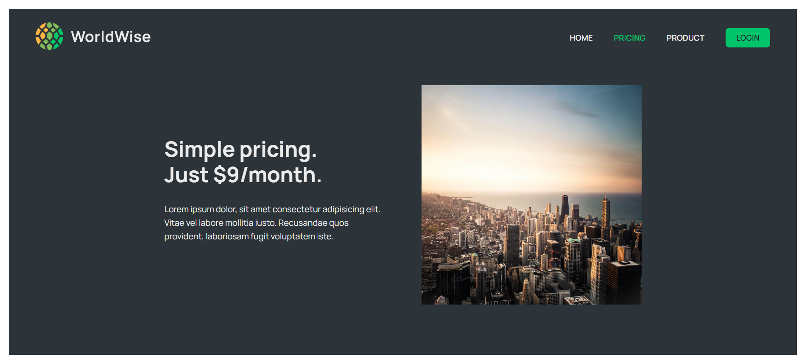
 
   
   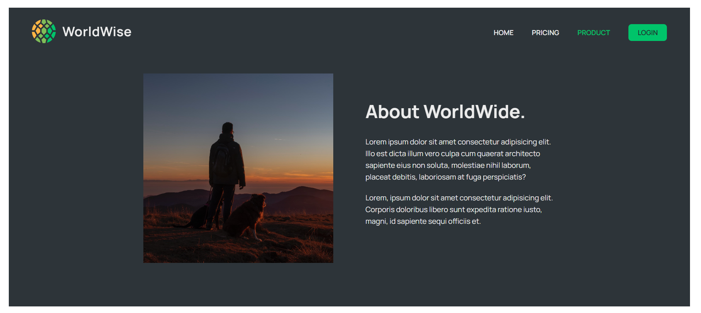
 
   
   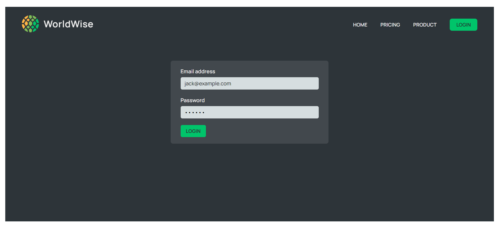
 
   
   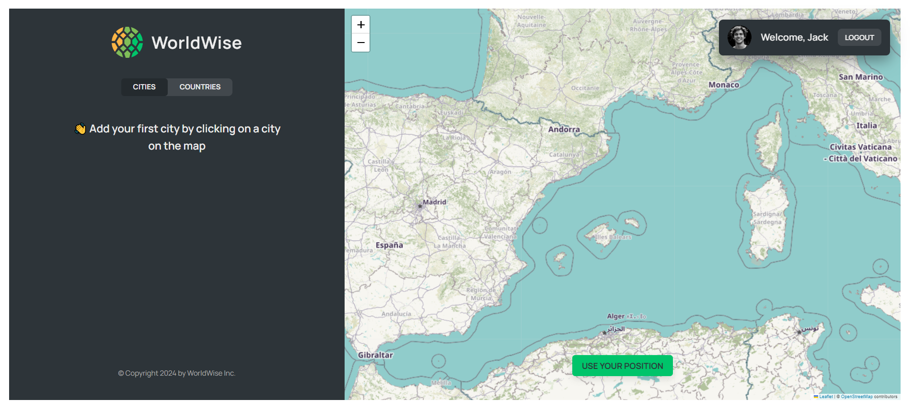
 
   
   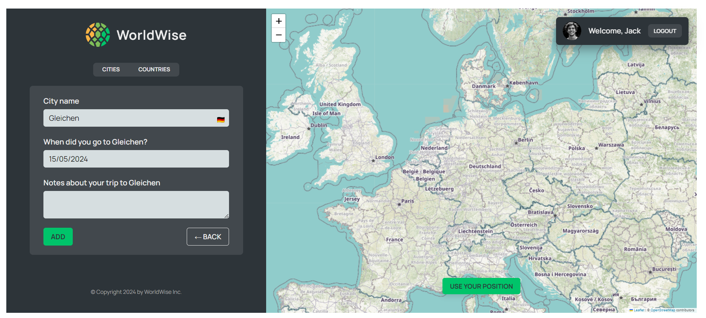
 
   
   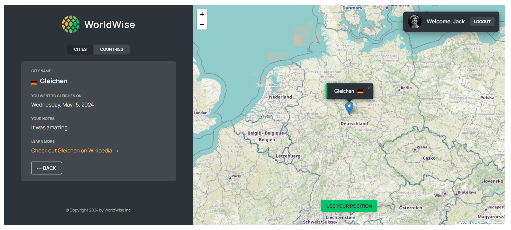
 
   
   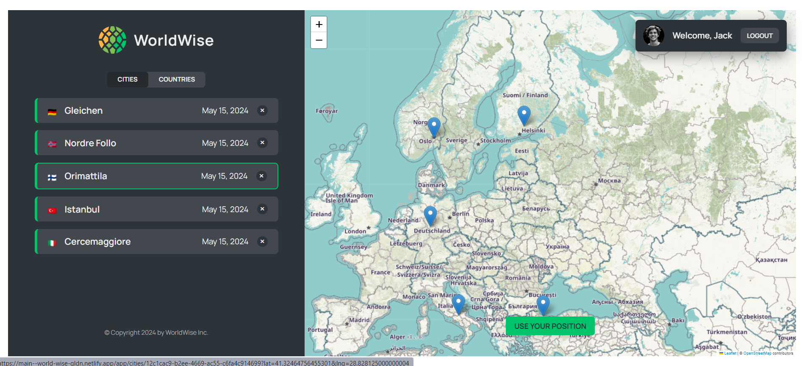
 
   
   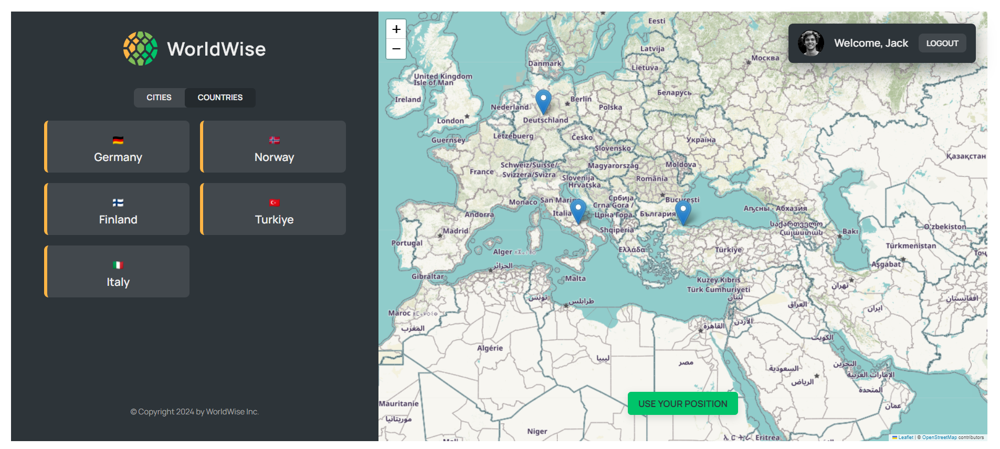
 
   
   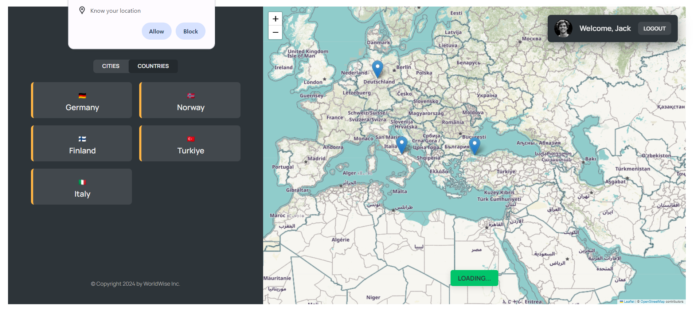
 
   
   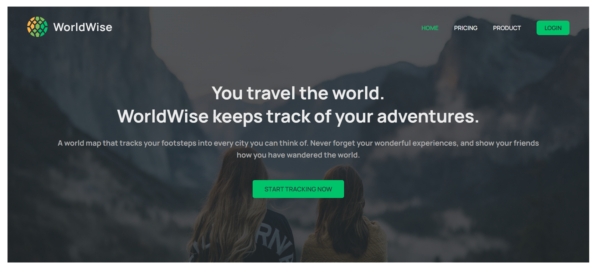
 
